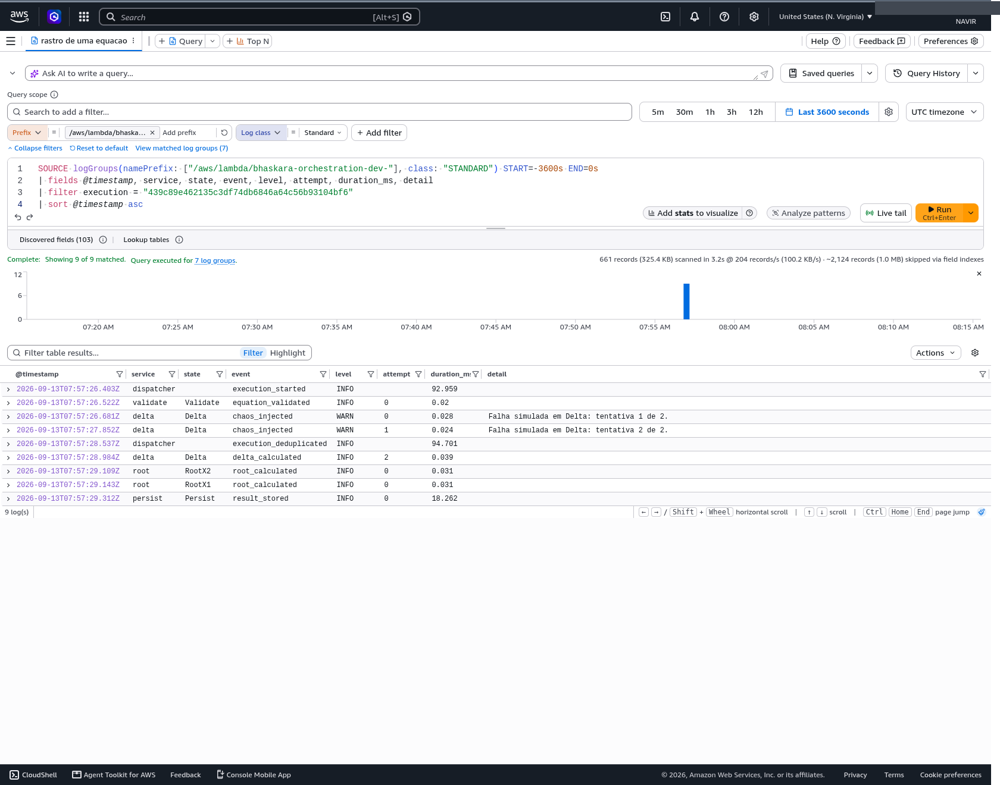
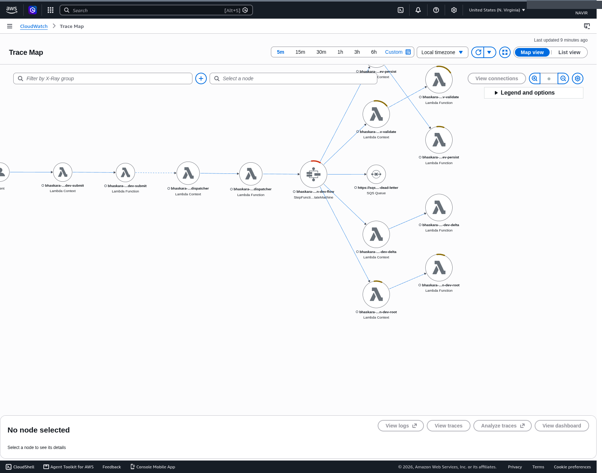
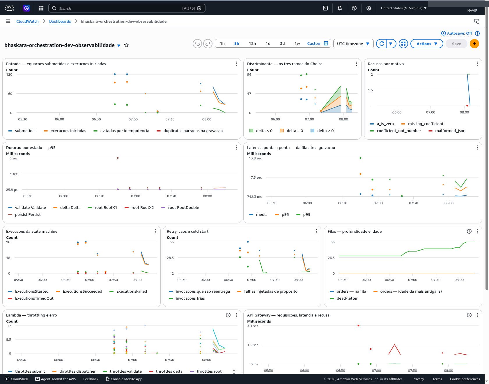
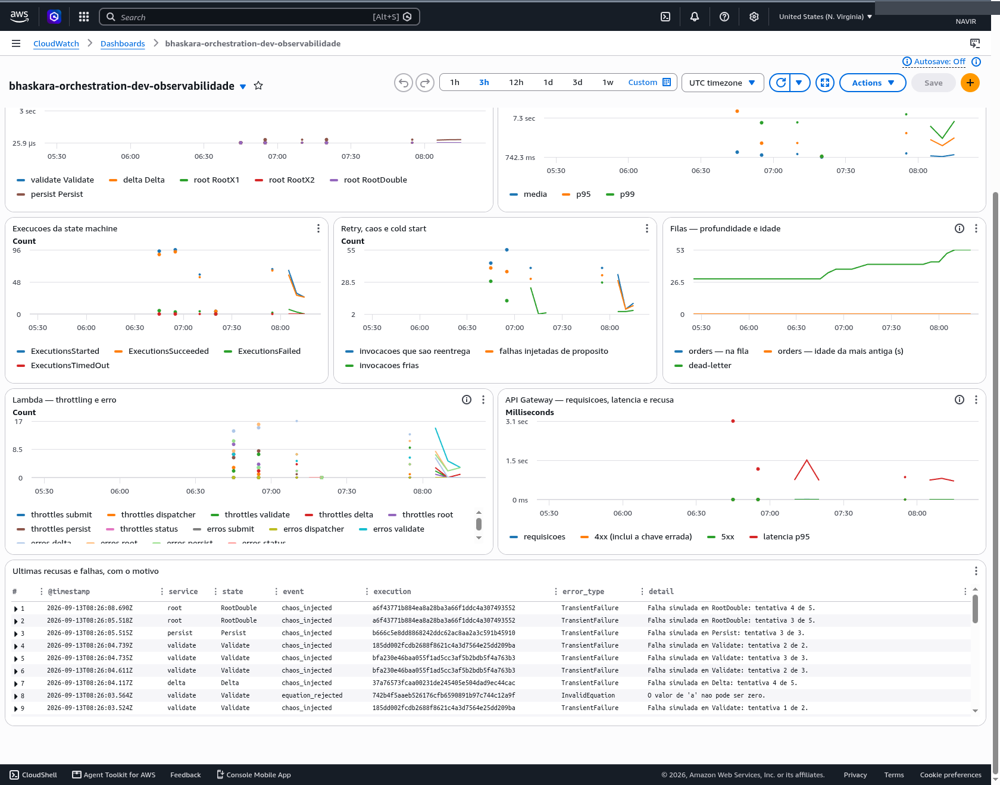
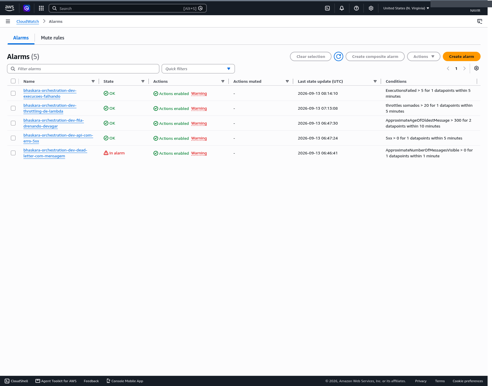
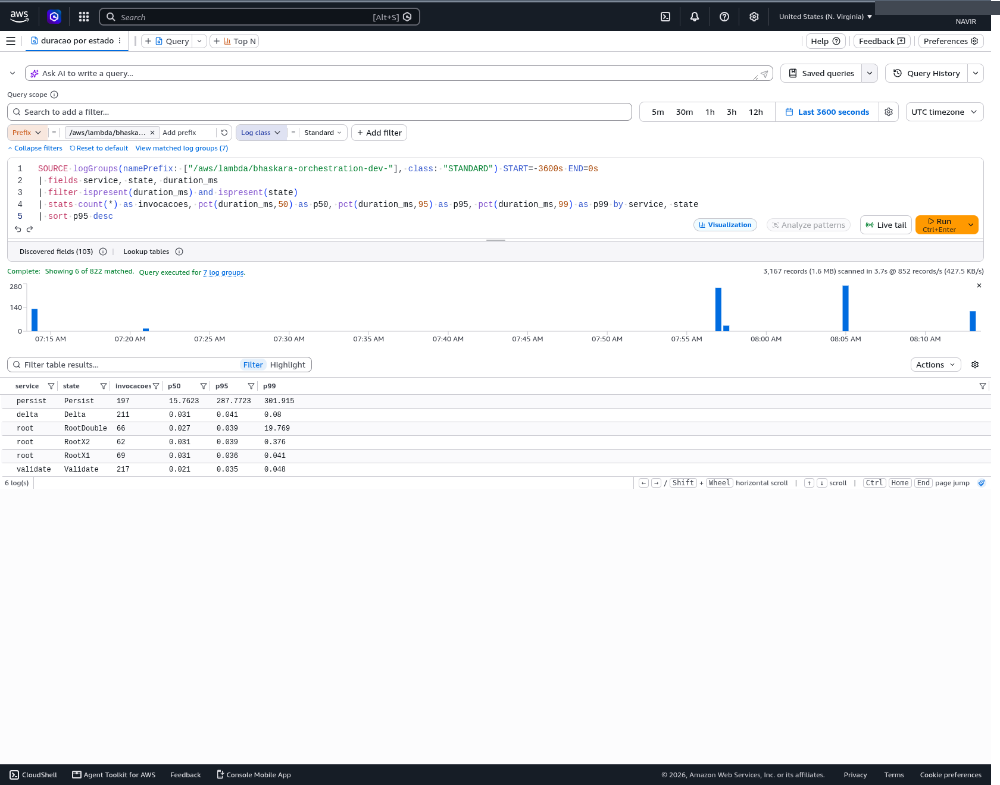
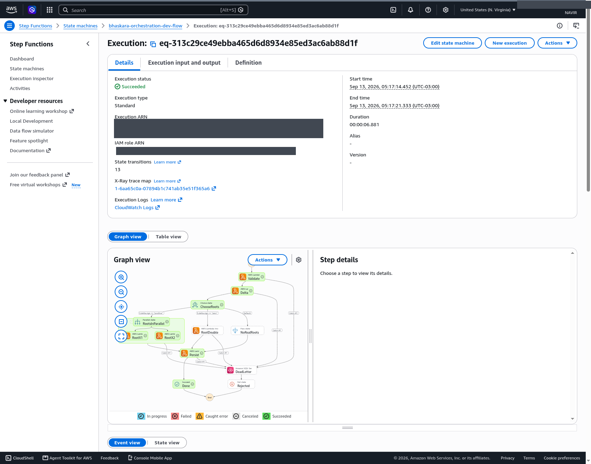

# Observabilidade do pipeline — Checkpoint 4

## Introdução

A disciplina propôs uma sequência de checkpoints voltados a exercitar conceitos
de arquitetura serverless e orientada a eventos. O problema a ser resolvido com
código ficou a critério de cada aluno, e o que escolhi foi o cálculo das raízes
de equações do segundo grau. Mantive o mesmo problema nas três entregas
anteriores, de modo que a diferença entre elas está inteira na arquitetura: a
primeira foi uma API síncrona, a segunda uma arquitetura orientada a eventos e a
terceira uma orquestração de serviços. Este quarto checkpoint muda a natureza da
tarefa. Em vez de construir mais um sistema, ele pede para instrumentar o que já
existe com registro estruturado e coleta de métricas, comprovar o funcionamento
com evidências visuais e, a partir dos dados coletados, propor de duas a três
otimizações técnicas fundamentadas.

O sistema instrumentado foi o do terceiro checkpoint, e vale descrevê-lo antes
de falar do que foi feito nele. Uma requisição HTTP chega a uma função que gera
a quantidade pedida de equações e as publica numa fila. Outra função consome
essa fila e transforma cada mensagem numa execução de uma máquina de estados do
Step Functions, cuja ordem está declarada em um arquivo YAML versionado junto
com o código. Dentro dessa máquina, cinco funções Lambda trabalham em sequência:
uma valida os coeficientes, outra calcula o discriminante, uma decisão escolhe o
caminho conforme o sinal desse discriminante, uma ou duas funções calculam as
raízes e a última grava o resultado num banco DynamoDB. O que falha de forma
irrecuperável vai para uma fila de mensagens recusadas com o motivo anexado. Um
painel web acompanha tudo isso acontecendo.

O sistema funcionava, mas era opaco por dentro. Havia registro de log, embora
cada função escrevesse do seu jeito, e não havia métrica alguma além das que a
AWS emite por conta própria, que contam invocações e erros sem saber o que é uma
equação. A construção da observabilidade seguiu quatro caminhos, tratados nos
parágrafos seguintes: padronizar o formato do log de modo que uma equação possa
ser rastreada por todas as etapas, extrair medidas de negócio do próprio log,
ligar o rastreamento distribuído que o checkpoint anterior havia deixado
desligado, e reunir tudo num painel com alarmes. Os dados que esses quatro
caminhos produziram sustentaram as três otimizações apresentadas na sequência,
sendo que a primeira delas revelou um problema de desempenho que existia desde
o checkpoint anterior sem que ninguém tivesse como perceber.

## Desenvolvimento

### O formato único de log

O primeiro caminho foi padronizar o que cada função escreve. Antes deste
checkpoint, as sete funções do sistema tinham cada uma a sua própria rotina de
registro, e cada chamada escolhia os campos que achava relevantes: a função de
validação gravava o identificador da execução, a que consome a fila gravava o
identificador do lote, e as de cálculo não gravavam nenhum dos dois. Reconstituir
o caminho de uma equação exigia saber de cor qual campo cada função usava. A
solução foi um módulo compartilhado que monta um envelope fixo, presente em toda
linha, com o nome do evento, o nível de severidade, a função que escreveu, a
etapa do fluxo em que ela estava, o identificador da equação, o do lote, o número
da tentativa, se aquela invocação precisou inicializar do zero e quanto tempo
decorreu. Nenhum desses campos precisou ser inventado, porque todos já
trafegavam no sistema; a mudança foi passar a registrá-los.

O ganho aparece quando se filtra o log por uma equação específica. A consulta
abaixo tem uma condição só e devolve as nove linhas que uma única equação
produziu ao atravessar cinco funções diferentes, incluindo as duas tentativas
que falharam no meio do caminho e a recuperação na terceira.

Lendo de cima para baixo, a equação entrou no fluxo, foi validada, falhou duas
vezes no cálculo do discriminante por causa do modo de injeção de falhas que o
sistema usa para demonstrar a recuperação, foi refeita na terceira tentativa,
teve as duas raízes calculadas em paralelo e foi gravada. O número da tentativa
subindo de zero a dois é o que torna a recuperação visível, e o nome da etapa é
o que permite distinguir as duas metades do cálculo paralelo, já que a mesma
função atende as duas e sem esse campo as linhas seriam idênticas.

### As métricas de negócio

O segundo caminho foi extrair medidas do próprio log. A AWS já contava
invocações, erros e duração de cada função, mas nenhuma dessas contagens sabe o
que é uma equação, quantas foram recusadas por coeficiente inválido ou quantas
caíram em cada um dos três caminhos possíveis do cálculo. Foram criadas onze
medidas de negócio: equações submetidas, execuções iniciadas, execuções
descartadas por já terem sido processadas, duplicatas barradas na gravação,
distribuição pelos três ramos do discriminante, recusas separadas por motivo,
duração por etapa, latência da fila até o resultado, invocações que precisaram
inicializar, invocações que são repetição e falhas injetadas de propósito.

A escolha técnica que vale explicar é como essas medidas chegam à AWS. O caminho
convencional seria cada função chamar a API de métricas a cada número que
quisesse registrar, o que acrescentaria uma chamada de rede a toda invocação,
consumiria parte do tempo disponível e criaria mais um ponto de falha dentro da
regra de negócio. O caminho adotado escreve a métrica dentro da própria linha de
log, num formato que a AWS lê depois por conta própria. O custo em tempo dentro
da função é zero e nenhuma permissão adicional foi necessária. Como efeito
colateral útil, a linha que virou um ponto no gráfico carrega também o
identificador da equação, então de um pico no painel se chega às execuções que o
causaram.

Houve uma restrição de custo que moldou o desenho. Uma métrica na AWS é cobrada
por combinação de valores dos seus rótulos, o que significa que usar o
identificador da equação como rótulo criaria uma série temporal nova a cada
equação processada, com cobrança mensal por cada uma. A primeira versão do
projeto criava 45 séries, o que daria US$ 13,50 por mês. Cortando os rótulos que
não se pagavam, o número caiu para 24, e existe um teste automatizado que falha
se alguém tentar usar um identificador como rótulo no futuro.

### O rastreamento distribuído

O terceiro caminho foi ligar o AWS X-Ray, que desenha o percurso de uma
requisição por todos os componentes e mostra o tempo gasto em cada um. O
checkpoint anterior havia deixado esse recurso desligado, com uma justificativa
registrada no próprio arquivo de infraestrutura: o histórico de execução do Step
Functions já mostrava tudo que interessava naquele momento, e o rastreamento é
cobrado por requisição registrada. A justificativa era boa para a pergunta
daquele checkpoint, que era saber se o fluxo estava correto. A pergunta deste
outro é onde o tempo está sendo gasto, e para ela o histórico não serve, porque
não separa o tempo da função do tempo de transição entre etapas nem mostra os
dois ramos paralelos sobrepostos. O recurso foi ligado, o comentário antigo foi
preservado com a data e o motivo da mudança, e o custo permaneceu dentro da
camada gratuita, que cobre cem mil rastreamentos por mês contra os cerca de cem
que uma demonstração gera.

### O painel e os alarmes

O quarto caminho reuniu tudo numa tela. O painel foi escrito em Terraform, junto
com o restante da infraestrutura, de modo que nasce no mesmo comando que cria o
sistema e desaparece no mesmo comando que o destrói. Ele não substitui o painel
web do projeto, que mostra o fluxo acontecendo e responde à pergunta do
operador sobre o que está sendo processado agora; este responde à pergunta de
como o sistema está se comportando, com latência, erro, saturação e custo.

Na faixa superior, o primeiro gráfico traz as equações submetidas contra as
execuções efetivamente iniciadas, e a distância entre as duas linhas é a
quantidade de equações repetidas que o sistema reconheceu e descartou antes de
processar. O segundo mostra a distribuição pelos três ramos do discriminante e
o terceiro separa as recusas por motivo. Logo abaixo aparecem a duração de cada
etapa e a latência da fila até a gravação, que é a medida mais próxima do que
um usuário sentiria.

A faixa inferior trata de falha e de capacidade, e termina com um quadro que
traz as últimas linhas de erro e alerta das sete funções, de modo que o caminho
entre notar algo estranho num gráfico e ler o que aconteceu se completa sem
trocar de tela. Os cinco alarmes seguem a mesma lógica de utilidade: cada um tem
escrito na própria descrição o que a pessoa deve fazer quando ele disparar, e o
limite de cada um foi escolhido para não tocar durante uma demonstração normal.
Durante a carga de teste, o alarme da fila de mensagens recusadas disparou
sozinho, sem ter sido forçado.

### Primeira otimização: onde a conexão com a AWS é criada

A primeira consulta feita depois de instalar tudo perguntou quanto tempo cada
etapa do fluxo levava, e o resultado trouxe uma anomalia grande demais para ser
ignorada. A etapa de gravação levava treze milésimos de segundo na maior parte
das vezes, mas em cinco por cento dos casos levava quase seis segundos, uma
diferença de mais de quatrocentas vezes entre o comportamento comum e o pior
caso. Separando as invocações que rodavam numa função já aquecida daquelas que
precisavam inicializar do zero, ficou claro que a lentidão inteira estava nas
frias. Isso apontava para a inicialização, mas o tempo de inicialização medido
era de apenas oitenta e três milésimos de segundo, o que significava que os seis
segundos aconteciam depois, já dentro do processamento da requisição.

A causa era uma decisão tomada no checkpoint anterior com boa intenção. O código
criava a conexão com o banco de dados de forma preguiçosa, apenas no momento em
que ela fosse usada pela primeira vez, para que a inicialização da função
ficasse leve. O efeito real era o oposto do pretendido, porque a AWS concede
processamento ampliado durante a fase de inicialização e o raciona depois; o
trabalho mais pesado estava sendo feito exatamente na janela em que ele custa
mais caro. A correção foram três linhas em quatro arquivos, movendo a criação da
conexão para o carregamento do módulo, com um resguardo que preserva o
comportamento preguiçoso fora da nuvem, do qual a suíte de testes depende.

O resultado foi medido com duas cargas idênticas de cento e vinte equações,
antes e depois da mudança. A invocação fria da etapa de gravação caiu de 5.972
para 243 milissegundos, o tempo cobrado médio dessa função caiu de 632 para 87
milissegundos, e a latência da fila até o resultado, considerando os cinco por
cento piores casos, caiu de 7.890 para 3.120 milissegundos. Cerca de 417
milissegundos migraram para a fase de inicialização, que é onde custam menos, de
forma que o trabalho não desapareceu e apenas mudou de lugar. Em valor
monetário, nesta escala, a economia é uma fração de centavo, e vale dizer isso
com clareza; o ganho real está na espera, que caiu pela metade, e na capacidade
liberada, já que a conta usada permite apenas dez execuções simultâneas e uma
função que ocupava seis segundos atrapalhava todas as outras.

### Segunda otimização: o volume de log da máquina de estados

A consulta que compara quanto cada componente escreve mostrou uma concentração
inesperada. A máquina de estados sozinha gerava 1,74 megabyte de log contra 763
kilobytes das sete funções somadas, ou 18,5 kilobytes por execução contra 8,1
kilobytes de todas as funções juntas, o que significa que um único componente
respondia por setenta por cento de tudo que o sistema escreve. A causa é uma
configuração que manda gravar a entrada e a saída de cada uma das nove etapas de
cada execução, e como a equação inteira viaja nesse conteúdo, o volume se
acumula depressa.

Desligar essa configuração foi testado com duas cargas iguais de trinta
equações. O volume caiu de 18.856 para 6.994 bytes por execução, uma redução de
sessenta e três por cento naquele componente e de quarenta e três por cento em
tudo que o sistema escreve. A dúvida que impedia adotar a mudança era saber o
que se perde junto, e a resposta veio inspecionando os eventos campo a campo: o
nome da etapa continua sendo gravado, de modo que todos os contadores e o
desenho do fluxo no painel seguem funcionando, e o motivo de uma falha também
permanece. O que se perde é o texto de detalhe que o painel mostra em cada
passo, e esse detalhe passa a vir de uma chamada de API que o código já fazia
para outro caminho. Aqui houve uma correção no próprio projeto, porque uma
versão anterior deste relatório afirmava que essa alternativa já estava
implementada quando o código chamava a API mas nunca lia o campo de saída; a
falta foi corrigida, coberta por quatro testes e verificada contra a AWS com a
configuração já desligada.

A otimização ficou confirmada e desligada, por uma razão que não é técnica. A
infraestrutura do checkpoint anterior continua no ar para correção, e o detalhe
em cada passo do painel faz parte daquela entrega, de forma que trocar o
comportamento dela enquanto está sendo avaliada significaria arriscar uma nota
para economizar cinquenta e nove centavos a cada cem mil execuções. A chave para
ligar a mudança está pronta numa variável do Terraform, e é uma linha de comando
quando a correção terminar.

### Terceira otimização: o cálculo paralelo das duas raízes

Quando o discriminante é positivo e a equação tem duas raízes distintas, o fluxo
abre dois ramos concorrentes e calcula uma raiz em cada um. A medição mostrou
que cada um desses cálculos leva trinta e um microssegundos. Para executar
sessenta e dois microssegundos de aritmética, o sistema gasta duas invocações de
função com nove milissegundos cobrados cada uma, três transições de estado em
vez de uma, e duas das dez execuções simultâneas que a conta permite. Essa
última parte é a mais relevante, porque a análise de desempenho mostrou que o
recurso escasso deste sistema é capacidade de execução simultânea, e não
processamento.

A recomendação aqui é deliberadamente condicional. O checkpoint anterior já
registrava no próprio código que essa divisão foi feita para demonstrar o
recurso de execução paralela, com finalidade didática, e a medição não
contradiz aquela decisão; ela apenas coloca um número nela. Em um sistema de
produção o caminho seria juntar os dois ramos numa etapa única, que é exatamente
o que o fluxo já faz quando a raiz é dupla. Neste repositório o paralelo
permanece, porque removê-lo apagaria a evidência da entrega anterior, que ainda
está sendo avaliada.

## Conclusão

O trabalho de instrumentar um sistema que já funcionava produziu dois tipos de
resultado. O primeiro é o esperado e estava no enunciado: existe agora um
registro padronizado que permite seguir uma equação por todas as etapas, existem
onze medidas de negócio que a AWS não teria como produzir sozinha, existe um
mapa do percurso de cada requisição e existe um painel com alarmes, tudo
declarado em Terraform e reproduzível por quem clonar o repositório.

O segundo resultado foi menos previsível e é o mais interessante. A
instrumentação encontrou, na primeira medição séria, um problema de desempenho
que existia desde o checkpoint anterior e que nenhuma revisão de código havia
apanhado, porque o código estava correto e a decisão que o causava tinha um
comentário explicando por que era uma boa ideia. Foram necessários dados reais
para mostrar que a boa ideia custava seis segundos. No mesmo sentido, os
quarenta erros registrados durante a carga de teste coincidem exatamente com as
quarenta falhas que o modo de caos injetou de propósito, e sem a métrica que
separa uma coisa da outra a leitura seria de que o sistema falhou em quarenta e
dois por cento das execuções, uma conclusão errada extraída de dados corretos.

Vale registrar também o que a observabilidade custa, já que ela não é gratuita.
Uma demonstração completa cabe na camada gratuita da AWS em todos os serviços
envolvidos, mas as vinte e quatro séries de métricas customizadas são cobradas
por mês independentemente do uso, o que resulta em até quatro dólares e vinte
centavos mensais. Isso invalidou uma afirmação do checkpoint anterior, que dizia
que a infraestrutura não tinha nenhum recurso de custo fixo, e a frase foi
corrigida no README em vez de ser mantida por inércia.

Por fim, três defeitos do próprio painel só apareceram no momento de capturar as
telas de evidência, e nenhum deles teria sido apanhado pelos testes ou pela
validação da infraestrutura, que passavam nos três casos. Dois eram erros de
sintaxe na consulta do quadro de log, sendo que o primeiro se manifestava como
ausência de dados em vez de erro, que é a forma mais cara de errar. O terceiro
não era defeito, e sim um quadro corretamente vazio porque nenhuma carga
anterior havia pedido equações inválidas. A lição que fica é que produzir a
evidência faz parte de construir a observabilidade, com o mesmo peso de escrever
o código que a coleta.

---

Os números brutos de todas as medições, com as tabelas completas de antes e
depois, estão em [`evidencias/medicoes.md`](evidencias/medicoes.md). As decisões
tomadas em cada ciclo de desenvolvimento estão registradas em
[`cycle-08.md`](cycle-08.md) a [`cycle-13.md`](cycle-13.md), e o plano original
em [`especificacao-cp4.md`](especificacao-cp4.md).
